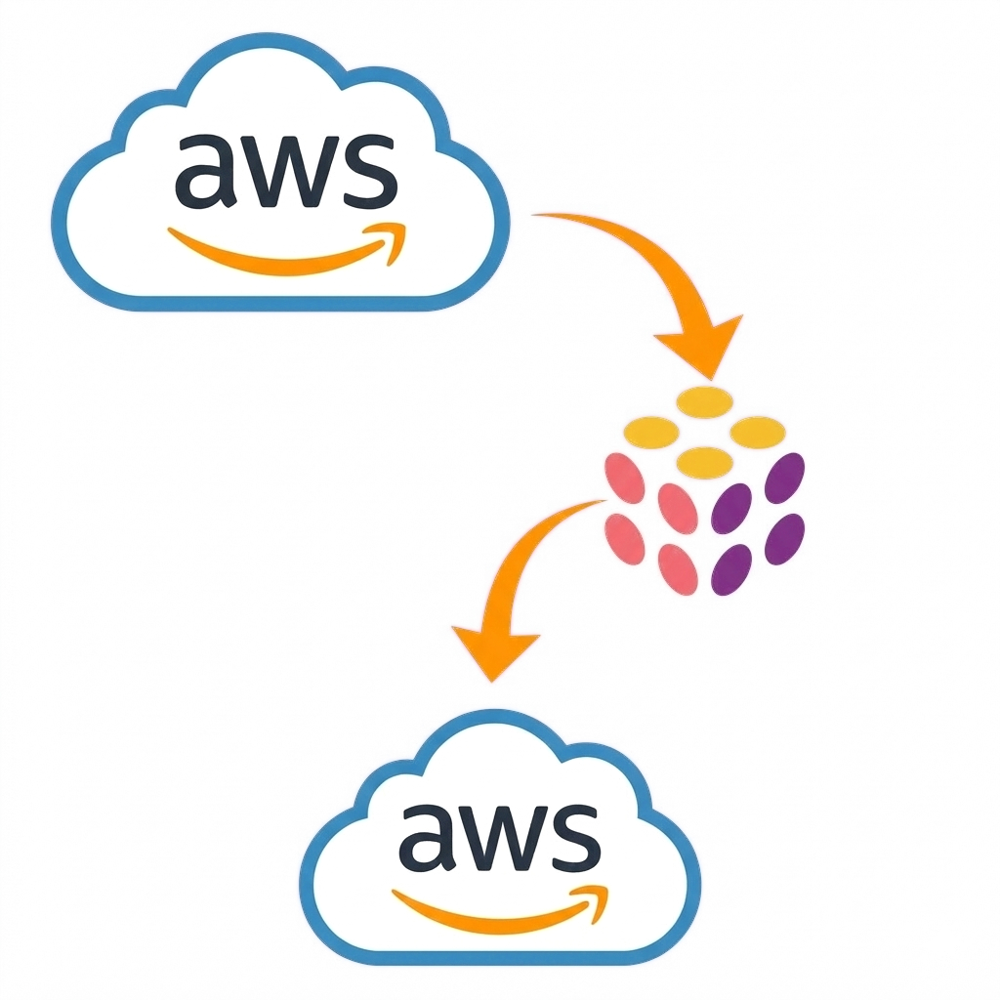

<!--
_backgroundImage: url("assets/background.png")
-->

<style scoped>
h1,h2,h4,p {
  text-align: center;
}
</style>
# Learning from Neo
#### and learning when to ignore it
<br>

## Paul Hicks
Puluminary
Developer
(Former?) AI sceptic

---
# My Goals
- Determine if Pulumi's new AI, Neo, can help new team members learn AWS and IaC
  - ..without breaking any of our clients' production environments

# My Approach
- Protect all the prods by using a new Pulumi project
- Design and solve a problem that showcases new Neo features
  * Query clouds resources in English
  * Write and refactor IaC
  * Write and run GitHub pipelines that deploy using Pulumi IaC

---

# My Strawman Context
Imagine there's a legacy project, deployed to an old AWS account.
There's no IaC, it was all done via the AWS console.
The owner wants to onshore and move to AWS' new NZ region.
So:
1. Find all the resources,
2. put them in IaC,
3. fix the IaC to point at the NZ region, and
4. deploy it there using some a basic CD(ish) pipeline.

<!--
Goals for the project (ap-southeast-6)
Goals for the presentation (new Pulumi features, and where AI let me down.)
Show of hands: I can add in a few extra hints, tips and demos about the Pulumi features I use that aren't particularly AI-related. SHould I?
-->


---
# Prequisites
- I have configured OIDC in Pulumi ESC for AWS
  - All connection from Pulumi to AWS use short-term credentials
  - No long-lived secrets are stored anywhere
- I have configured the GitHub integration in my Pulumi organisation's settings
  - Enables Pulumi IaC to enrich PRs with previews and more
  - Enables Pulumi Neo to read and review code, and create PRs for changes it suggests (or makes)

---
# Discovering Unmanaged Resources
<!--
Pulumi Insights is a subscription-only feature that scans an "Account" to find cloud resources, both managed and unmanaged.
A Pulumi Insights account corresponds very closely to as AWS account, an Azure Subscription or a GCP Project.
This is an easy bit to demo but it's not really relevant to the AI-themed evening. Refer to show of hands above. If it's voted in, navigate to
https://app.pulumi.com/paulhicks_demo/insights/accounts/create
and follow the wizard.

-->

- Create an Insights "Account" using the existing AWS OIDC connection
- Scan the created account and wait a few minutes
- All the discovered resources are listed at "Resources" in the left bar

---
# Finding the Resources to Manage


- Problem: Discovered too many resources!
  - AWS creates many resources for its own use
  - Most aren't relevant to the app I want to migrate
- AI-assisted solution: Pulumi AI Assist
  - Promises to help me find only my resources
  - In English!

  <!-- Demo here
   -->

---
<style scoped>
  /* This overrides the flex display type that this theme uses */
  section {
    display: block;
  }
  section table {
    display: table;
    width: 100%;
    /* table-layout: fixed; */
    /* word-wrap: true; */
  }
</style>

# Knowledge Gap 1 - AI Assist Weirdnesses
The AI-to-search syntax translation is not documented and is so finnicky
| Works | Doesn't Work |
| --- | --- |
| `category storage` | `storage` |
| `module = cloudfront` | `module cloudfront` _(&#x2261; `cloudfront`)_ |
| _Nothing_ | `(category is network) OR (category is storage)` <br> `category network or category storage` <br> `anything in network or storage` |

<sub>In the end I went with `category is network or (category is storage and stack is ap-southeast-2)`, fixed the query in Pulumi Search Syntax, and used my domain knowledge to pick the correct six resourcs.</sub>

---
<!--
_footer: Would you like a demo?
 -->
# Generating and Enhancing the Code

- Generation is done using existing Pulumi rules, so it's not AI (but it is very smart)
- Lots of compile errors and non-best-practices, but AI will save us!
- Resources in the code and in the cloud aren't always 1:1
- The "Enhance" button is a general-purpose AI refactorer with some Pulumi- and cloud provider-specific knowledge
- It is non-deterministic and can be improved by running it on its own output
- Fun fact - it will quite happily accept and refactor any code you paste into it
- Sometimes there's more than one way to do things
  - (And somehow the code generation never wants to it my way)

---
<!-- Summary if glossing over: Pulumi domain knowledge is needed to convert code generated by Insights into a working Pulumi project. -->
# Knowledge Gap 2 - Where Do I Run This?
- You have to install Pulumi IaC and create a new Pulumi project.. but wait!
- AI will save us! Just run `pulumi new` in the new folder
  - An `ai` option! It will generate code for us, using Neo
  - Unfortunately if you ask it to generate C#, it will produce an invalid .csproj file
    - It uses net6, which is out of support and produces warnings
    - It depends on System.Collections.Generic, which is not in nuget
- Oh well, no AI here. Use the vanilla aws-csharp template and replace the Program.cs with the generated code

---
<!--
_header: I can show you the Neo chat
_footer: Would you like a demo?
 -->
<!-- Look at Neo conversation "Fix compile errors upgrade provider" -->
 <style scoped>
  div.left li {
    padding-bottom: 15px;
  }
  div.right ul {
    font-size: 18pt;
  }
</style>
# The First Win for AI - Learning C# With Neo

<div class="columns">
<div class="left">

- Now try some vibecoding!
- Language-specific
- Pulumi-specific
- Cloud provider-specific
- Nice PRs in GitHub, and excellent rationale in the Neo conversation

</div>
<div class=right>

- "Fix the compile errors"
- "Remove all the importIds so that new resources are created"
- "Add exports for the website URL and bucket name"
- "Refactor the bucket, the public access block and the ownership controls into a single component resource"
- "Don't set resource names and don't set properties to their default values"

</div>
</div>

---

<!--
_header: I can show you the Neo chat
_footer: Would you like a demo?
 -->
<!-- Look at Neo conversation "Fix compile errors upgrade provider" -->
 <style scoped>
  div.right ul {
    font-size: 18pt
  }
</style>
# The Second Win for AI - Learning GitHub Workflows with Neo

<div class="columns">
<div class="left">

- Pipelines can be built for us
  - Don't have to learn any new syntax

- Can create any number of workflows
  - Watch out for manually-triggered workflows - GitHub won't easily show those

</div>
<div class=right>

  - "GitHub says there are no checks, can you add the most sensible ones?"
  - "Can the workflow get short-lived AWS credentials via Pulumi ESC?"
  - "Create a manually triggered workflow that will run `pulumi preview` then, if that is successful, offer a manual step to also run `pulumi up`?". Neo's suggestion is great, and GitHub-idiomatic.
</div>
</div>

---
<!--
_header: I can show you the Neo chat
_footer: Would you like a demo?
 -->
<!-- Look at Neo conversation "Fix empty S3 bucket deployment" -->
# Knowledge Gap 3 - Insights' missing resources

<div class="columns">
<div class="left">

### What's wrong?
- Insights generated rudimentary IaC from our S3 Bucket and CDN &#x1f600;
- Neo fixed our IaC and greatly enhanced it and our pipelines &#x1f389;
- Pulumi IaC deployed our copied resources &#x1f325;
- But the app doesn't work! &#x1f61e;

</div>
<div class=right>

### Why doesn't it work?
- Insights didn't find the _contents_ of the bucket
- But Neo can fix that, so long as you have copies of the original files
- Asked Neo to fix it - so easy
- It even looked into another project in the same repo and used the same pattern!
</div>
</div>

---
<!--
_header: I can show you the Neo chat
_footer: Would you like a demo?
 -->
<!-- Look at Neo conversation "Refactor JSON policy to strongly..." -->
<style scoped>
  div.right ul li ul li {
    font-size: 16pt;
  }
</style>
# Gap? Win? Let's Call This One a Draw

<div class="columns">
<div class="left">

- Neo hasn't yet detected the non-idiomatic (and visually ugly) bucket policy
```csharp
return $@"{{
  ""Statement"": [
    {{
      ""Action"": ""s3:GetObject"",
      ""Effect"": ""Allow"",
      ""Condition"": {{
        ""StringEquals"": {{
          ""AWS:SourceArn"": ""{distArn}""
        }}
      }},
}}"; // Snipped...
```

</div>
<div class=right>

- But it will make the correct changes with some prompting
  - "Remove the `"` and `{` bits"
  - "Change `Apply()` to `Output.Format()`"
```csharp
{ Statements = new[] {
    new GetPolicyDocumentStatementInputArgs {
        Actions = new[] { "s3:GetObject" },
        Effect = PolicyStatementEffect.Allow,
        Conditions = new[] {
            new GetPolicyDocument/*...*/Args {
                Test = "StringEquals",
                Variable = "AWS:SourceArn",
                Values = new[] { cfDistr.Arn },
            },
        },
    // Snipped...
```
</div>
</div>

---
<style scoped>
  h2 {
    text-align: center;
  }
</style>
<!--
_backgroundImage: url(./assets/pulumipus-chemist.png)
-->
# Can Neo help new devs learn AWS and Pulumi IaC?

<div class="leftbar">
<div class="left">

## No
- Pulumi Insights/Import code _needs_ to be improved before it can be used
- New projects are hard to start
- Good prompt engineering depends on existing domain knowledge
</div>
<div class="right">

## Yes
- Neo writes much better code than Import
  - Especially with good examples nearby
- Improving and extending existing projects is really easy
- Neo conversations give at least "journeyman" quality suggestions even with poor prompts
</div>
</div>

---
<!--
_header: Bonus conclusion slide!
-->
# Can Neo help experienced AWS / Pulumi devs?

- Everything is much faster
- An extra peer for your review
  - Want to review an open PR against the AWS Well-Architected Framework?
- Multiple languages - convert an example to your preferred language
- The conversations are audit trails of decisions and conclusions - very DevOps!


### Just don't trust it yet - it really doesn't care if it breaks all of your clients' production environments

---

<style scoped>
h1 {
  text-align: center;
}
</style>

# Thank you!
# Questions?