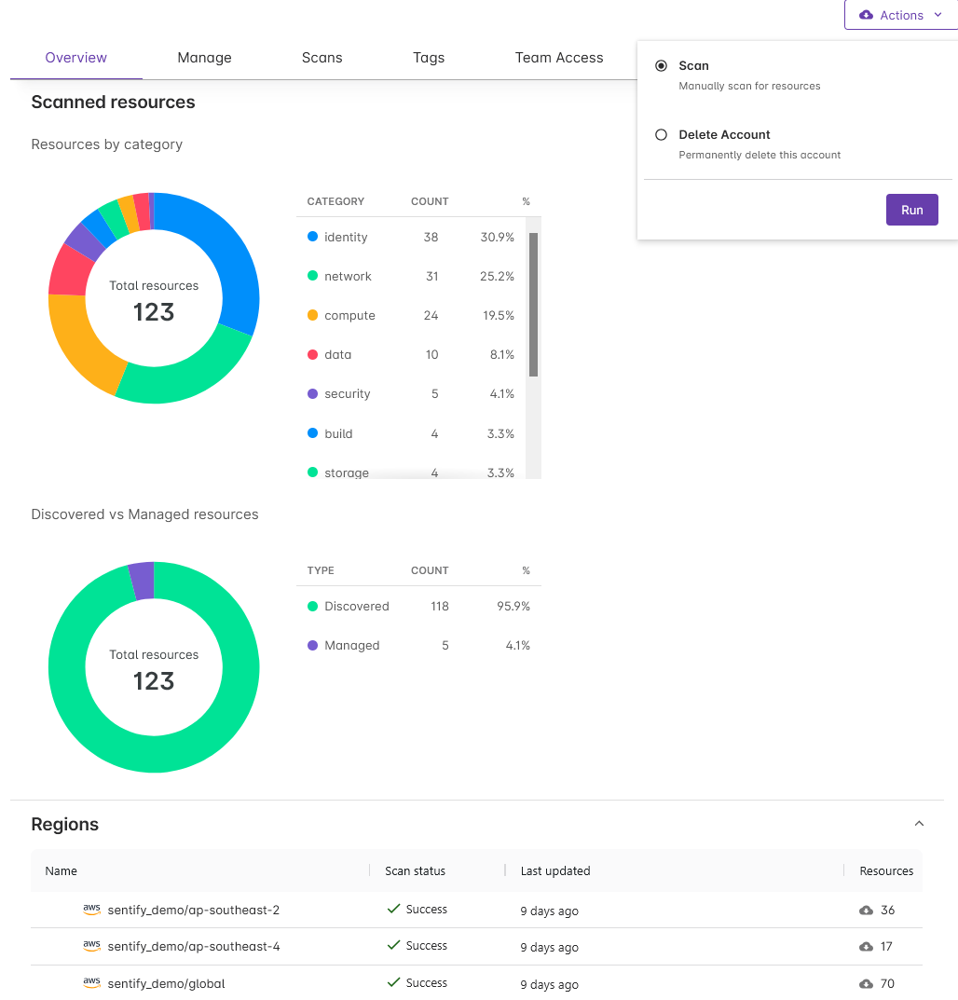
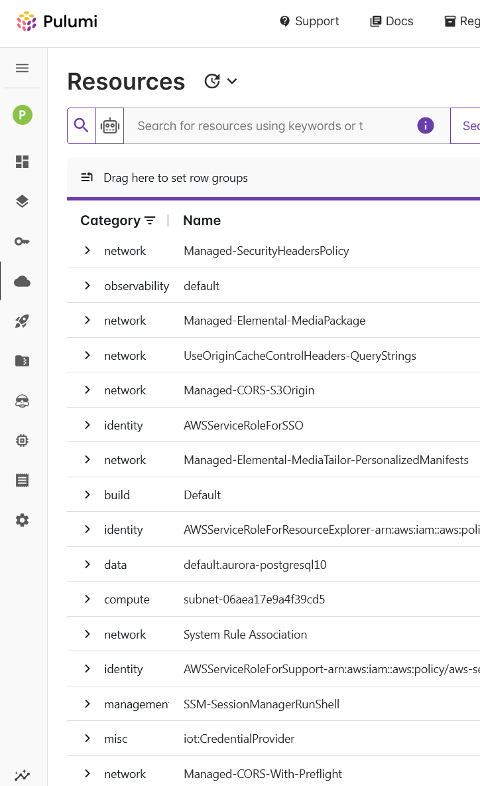

<!--
_backgroundImage: url("assets/background.png")
-->

# A Slide!
## A topic
### A subtopic

---
# Intro Slide

## Paul Hicks
Puluminary
Former AI Sceptic

---

# My Learning Goals
- Use Pulumi's new AI, Neo
  - Don't break any of our clients' production environments

# My Approach
- Protect all the prods by using a new Pulumi project
- Design and solve a problem that showcases new Neo features
  * Query clouds resources in English
  * Write and refactor IaC
  * Write and run GitHub pipelines that deploy using Pulumi IaC

---
# Vague Project Description
Imagine there's a legacy project, deployed to an old AWS account.
There's no IaC, it was all done via the AWS console.
The owner wants to onshore and move to AWS' new NZ region.
So:
1. Find all the resources,
2. put them in IaC,
3. fix the IaC to point at the NZ region, and
4. deploy it there using some a basic CD(ish) pipeline.

<!--
Goals for the project (ap-southeast-6)
Goals for the presentation (new Pulumi features, and where AI let me down.)
Show of hands: I can add in a few extra hints, tips and demos about the Pulumi features I use that aren't particularly AI-related. SHould I?
-->


---

# Technical Intro
- I have configured OIDC in Pulumi ESC for AWS
  - All connection from Pulumi to AWS use short-term credentials
  - No long-lived secrets are stored anywhere
- I have configured the GitHub integration in my Pulumi organisation's settings
  - Enables Pulumi IaC to enrich PRs with previews and more
  - Enables Pulumi Neo to read and review code, and create PRs for changes it suggests (or makes)

---

# Discovering Unmanaged Resources
<!--
Pulumi Insights is a subscription-only feature that scans an "Account" to find cloud resources, both managed and unmanaged.
A Pulumi Insights account corresponds very closely to as AWS account, an Azure Subscription or a GCP Project.
This is an easy bit to demo but it's not really relevant to the AI-themed evening. Refer to show of hands above. If it's voted in, navigate to
https://app.pulumi.com/paulhicks_demo/insights/accounts/create
and follow the wizard.

-->

- Create an Insights "Account" using the existing AWS OIDC connection
- Scan the created account and wait a few minutes
- All the discovered resources are listed at "Resources" in the left bar

---

# Finding the Resources to Manage


- Problem: Discovered too many resources!
  - AWS creates many resources for its own use
  - Most aren't relevant to the app I want to migrate
- AI-assisted solution: Pulumi AI Assist
  - Promises to help me find only my resources
  - In English!

  <!-- Demo here
   -->

---
<style>
  /* This overrides the flex display type that this theme uses */
  section {
    display: block;
  }
  section table {
    display: table;
    width: 100%;
    table-layout: fixed;
    word-wrap: true;
  }
</style>

# The First Knowledge Gap - AI Assist Weirdnesses
The AI-to-search syntax translation is not documented and is so finnicky
| Works | Doesn't Work |
| --- | --- |
| `category storage` | `storage` |
| `module = cloudfront` | `module cloudfront` <br> (which is the same as `cloudfront`) |
| `(category is network) (category is storage)` | `category network or category storage` <br> `network or storage category` <br> `anything in network or storage` |

---
# Generating the Code
- This is achieved using existing Pulumi rules, so it's not AI (but it is very smart)
- Some AWS resources map to multiple Pulumi resources, and sometime the opposite is true - so review the generated code!
- The code generation smarts don't get updated as often as the providers!
  - I want to use the current AWS provider v7
  - But the code generated is v6 (but don't worry, AI will save us!)
- Sometimes there's more than one way to do things
  - (And somehow the code generation never wants to it my way)

---
# The Mystery AI "Enhance" Button
- It is a general-purpose refactorer
  - Extracts and de-duplicates literal and constrant structs to named variables
  - Improves formatting including indentation
  - Adds basic comments, including TODOs for improvements it doesn't have the information to complete
  - Fun fact - it will quite happily accept and refactor any code you paste into it
- It has Pulumi- and cloud provider-specific knowledge too
  - Mostly improves the quality of generated comments
- It is non-deterministic and can be improved by running it on its own output
---
# The Second Knowledge Gap - Where Do I Run This?
- You have to install Pulumi IaC and create a new Pulumi project.. but wait!
- AI will save us! Just run `pulumi new` in the new folder!
  - An `ai` option! It will generate code for us, using Neo!
  - Unfortunately if you ask it to generate C#, it will produce an invalid .csproj file
    - It uses net6, which is out of support and produces warnings
    - It depends on System.Collections.Generic, which is not in nuget
- Oh well, no AI here. Use the vanilla aws-csharp template and replace the Program.cs with the generated code
---

# The First Win for AI - Learning C# With Neo

---

# The Second Win for AI - Learning GitHub Workflows with Neo

---

```ts
import * as aws from "@pulumi/pulumi-aws";
```

```csharp
using System;
```
---
